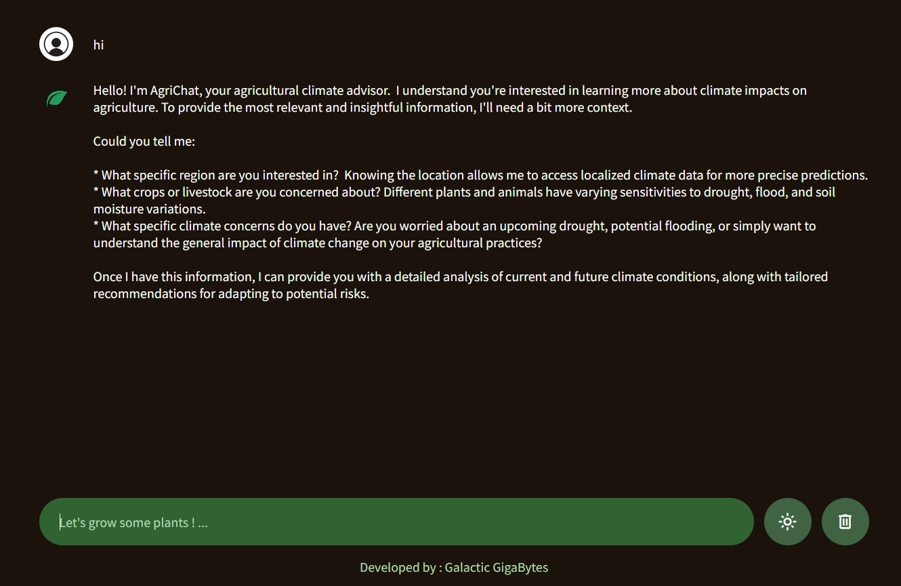

<div align="center">

# 🌾 AgriChat - AI-Powered Agricultural Assistant

[](https://agrichat.vercel.app/)
[](LICENSE)
[](https://ai.google.dev/)

*An intelligent agricultural assistant that leverages AI to provide climate predictions, soil analysis, and farming recommendations to help farmers make data-driven decisions.*



</div>

## 🎯 Overview

**AgriChat** is a cutting-edge AI-powered chatbot specifically designed to address the complex challenges faced by modern agriculture. By analyzing climate data and environmental factors, AgriChat provides farmers with accurate predictions and actionable insights for:

- 🌦️ **Climate Forecasting** - Drought and flood risk assessment
- 🌱 **Soil Analysis** - Moisture levels and soil health monitoring  
- 📈 **Crop Optimization** - Yield maximization strategies
- ⚠️ **Risk Management** - Early warning systems for weather-related threats

## ✨ Key Features

### 🤖 **Intelligent Conversational AI**
- Natural language processing in both Arabic and English
- Context-aware responses tailored to agricultural needs
- Real-time climate and soil moisture predictions

### 🎨 **Modern User Interface**
- **Responsive Design** - Optimized for desktop and mobile devices
- **Dark/Light Theme** - Toggle between themes with persistent preferences
- **Typing Animation** - Realistic chat experience with typing indicators
- **Message Management** - Copy, save, and delete chat history

### 💾 **Data Persistence**
- **Local Storage** - Chat history and preferences saved locally
- **Session Recovery** - Resume conversations after page refresh
- **Export Functionality** - Save important conversations

### 🚀 **Performance & Reliability**
- **Fast Response Times** - Optimized API integration
- **Error Handling** - Graceful degradation with informative error messages
- **Offline Indicators** - Connection status monitoring

## 🔧 Technologies

<div align="center">

| Frontend | AI/ML | Deployment |
|----------|-------|------------|
|  |  |  |
|  |  |  |

</div>

## 🚀 Quick Start

### Prerequisites
- Modern web browser (Chrome, Firefox, Safari, Edge)
- Internet connection for AI functionality

### Installation

1. **Clone the repository**
   ```bash
   git clone https://github.com/elewashy/AgriChat.git
   cd AgriChat
   ```

2. **Launch the application**
   ```bash
   # Open directly in browser
   open index.html
   
   ```

3. **Start chatting!**
   - Open your browser and navigate to the application
   - Begin asking agricultural questions
   - Explore the various features and themes

## 💡 Usage Examples

### Sample Questions You Can Ask:

```
🌦️ Climate & Weather
• "What's the drought risk for wheat farming this season?"
• "Should I be concerned about flooding in the next month?"
• "How will the upcoming weather affect my corn crop?"

🌱 Soil & Crop Management  
• "How do I improve soil moisture retention?"
• "What's the optimal planting time for tomatoes?"
• "How can I prevent soil erosion on my farm?"

📊 Data Analysis
• "Analyze the climate trends for my region"
• "What irrigation schedule do you recommend?"
• "How do I prepare for extreme weather events?"
```

## 🏗️ Project Structure

```
AgriChat/
├── 📄 index.html              # Main application entry point
├── 📁 assets/
│   ├── 🎨 style.css          # Application styling
│   ├── ⚡ script.js          # Core functionality & API integration
│   └── 📁 images/            # UI assets and branding
│       ├── logo_light.png    # Light theme logo
│       ├── logo_dark.png     # Dark theme logo
│       ├── chat.png          # Chat interface icons
│       └── Preview.png       # Application preview
├── 📜 LICENSE                # MIT License
└── 📖 README.md             # Project documentation
```

## 👥 Development Team

<div align="center">

| Developer | Role | GitHub |
|-----------|------|--------|
| **Mohamed El-Ewashy** | Lead Developer | [](https://github.com/elewashy) |
| **Abdulrahman Ayman Farid** | Frontend Developer | [](https://github.com/Abdulrahman-Ayman-Farid) |
| **Abdelrahman Mohamed** | Backend Integration | [](https://github.com/beedo239e) |
| **Mazen Ehab** | UI/UX Designer | [](https://github.com/MazenEhabGamal) |
| **Yousef Sharaf** | Quality Assurance | [](https://github.com/IISharafII) |

</div>


## 🔒 Privacy & Security

- **Data Protection**: No personal data stored on servers
- **Local Storage**: Chat history stored locally on user's device
- **API Security**: Secure communication with Gemini AI
- **No Tracking**: Privacy-focused design with no analytics tracking


## 📄 License

This project is licensed under the **MIT License** - see the [`LICENSE`](LICENSE) file for details.

---

<div align="center">

**Built with ❤️ for the farming community**

[](https://agrichat.vercel.app/)

*Empowering farmers with AI-driven insights for sustainable agriculture*

</div>
